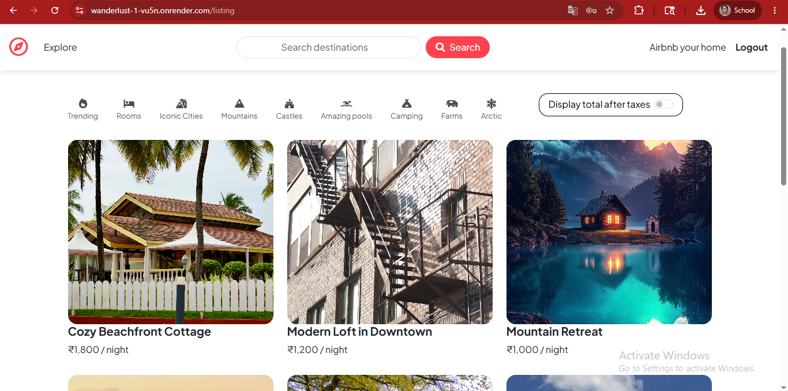
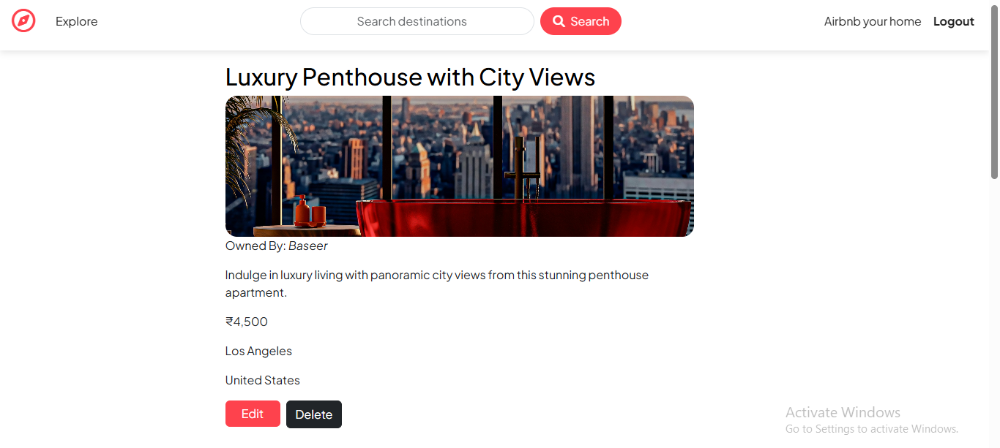
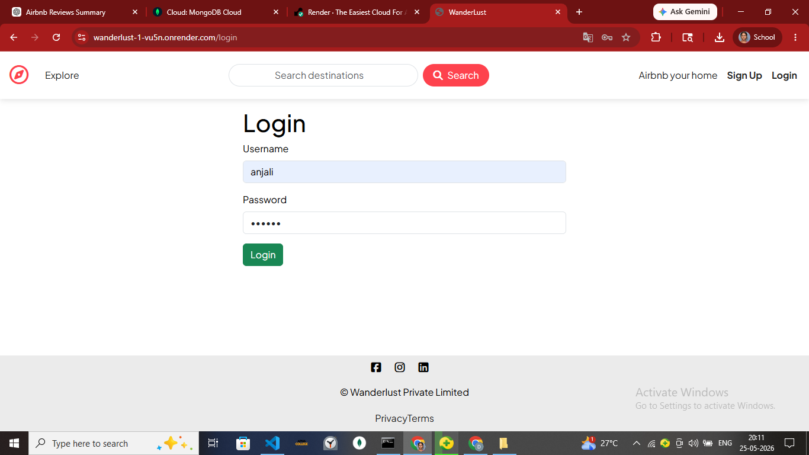

# Wanderlust - Airbnb Clone

Wanderlust is a full-stack Airbnb-inspired web application where users can explore travel listings, create and manage properties, upload images, leave reviews, and authenticate securely.

The project follows the **MVC (Model-View-Controller)** architecture for better scalability, maintainability, and clean separation of concerns.

## Live Demo

🔗 Add your deployed Render URL here

Example:

https://your-wanderlust.onrender.com

---

## Features

- User Authentication (Signup/Login/Logout)
- Create, Read, Update, Delete Listings (CRUD)
- Add & Delete Reviews
- Image Upload with Cloudinary
- Interactive Maps with Mapbox
- Flash Messages & Error Handling
- Authorization & Route Protection
- Server-side Validation using Joi
- Responsive UI using Bootstrap
- MVC Architecture

---

## Tech Stack

### Frontend
- HTML
- CSS
- Bootstrap
- EJS
- JavaScript

### Backend
- Node.js
- Express.js

### Database
- MongoDB Atlas
- Mongoose

### Authentication & Session Management
- Passport.js
- Passport Local
- Express Session
- Connect MongoDB Session Store

### Cloud Services & APIs
- Cloudinary (Image Upload)
- Mapbox (Location Maps)

### Deployment
- Render

---

## Project Structure (MVC)

```txt
wanderlust/
│
├── controllers/              # Application logic
│
├── init/                     # Database initialization / seed files
│
├── models/                   # MongoDB schemas
│
├── public/
│   ├── css/
│   │   └── style.css         # Styling
│   │
│   └── js/
│       ├── map.js            # Mapbox functionality
│       └── script.js         # Frontend scripts
│
├── routes/
│   ├── listing.js            # Listing routes
│   ├── review.js             # Review routes
│   └── user.js               # Authentication routes
│
├── utils/
│   ├── expressError.js       # Custom error handling
│   └── wrapAsync.js          # Async error wrapper
│
├── views/
│   │
│   ├── includes/
│   │   ├── flash.ejs         # Flash messages
│   │   ├── footer.ejs        # Footer component
│   │   └── navbar.ejs        # Navbar component
│   │
│   ├── layouts/
│   │   └── boilerplate.ejs   # Base layout template
│   │
│   ├── listings/
│   │   ├── index.ejs         # Listings page
│   │   ├── show.ejs          # Listing details
│   │   ├── edit.ejs          # Edit listing
│   │   └── new.ejs           # Create listing
│   │
│   ├── users/
│   │   ├── login.ejs         # Login page
│   │   └── signup.ejs        # Signup page
│   │
│   └── error.ejs             # Error page
│
├── app.js                    # Main server file
├── cloudConfig.js            # Cloudinary configuration
├── middleware.js             # Custom middleware
├── schema.js                 # Joi validation schemas
│
├── package.json
└── README.md
```

---

## Installation & Setup

### 1. Clone the Repository

```bash
git clone https://github.com/your-github-username/wanderlust.git
```

### 2. Navigate to the Project Folder

```bash
cd wanderlust
```

### 3. Install Dependencies

```bash
npm install
```

### 4. Configure Environment Variables

Create a `.env` file in the root directory and add:

```env
ATLASDB_URL=your_mongodb_connection_string

SECRET=your_secret_key

CLOUD_NAME=your_cloudinary_name
CLOUD_API_KEY=your_cloudinary_api_key
CLOUD_API_SECRET=your_cloudinary_api_secret

MAP_TOKEN=your_mapbox_token
```

### 5. Run the Project

```bash
node app.js
```

or

```bash
nodemon app.js
```

---

## Core Functionalities

### User Authentication
- Secure Signup/Login
- Session-based authentication
- Protected routes using middleware

### Listings Management
- Create new property listings
- Edit listing details
- Delete listings
- Upload listing images

### Reviews System
- Add reviews to listings
- Delete reviews
- Rating support

### Maps Integration
- Interactive location maps using Mapbox

### Error Handling
- Custom Express error handling
- Async error wrapping using `wrapAsync`

---

## Screenshots

Add screenshots here for better project presentation.

Example:

```md



```

---

## Future Improvements

- Search & Filter Listings
- Wishlist/Favorites
- Booking System
- Payment Integration
- Advanced Recommendation Features

---

## Learning Outcomes

This project helped me strengthen my understanding of:

- MVC Architecture
- RESTful Routing
- Authentication using Passport.js
- MongoDB Atlas & Mongoose
- Cloudinary Integration
- Mapbox API Integration
- Session Management
- Error Handling in Express
- Full-Stack Web Development
- Deployment using Render

---

## Author

**Dharshini M R**

GitHub: [https://github.com/DharshiniMR]

LinkedIn: [https://www.linkedin.com/in/dharshini-m-r-12a4a31ab/]
